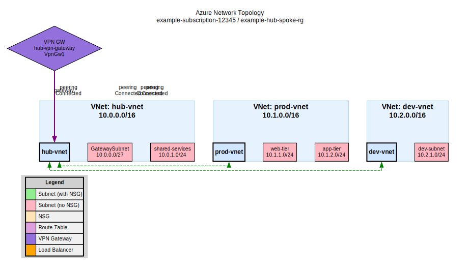
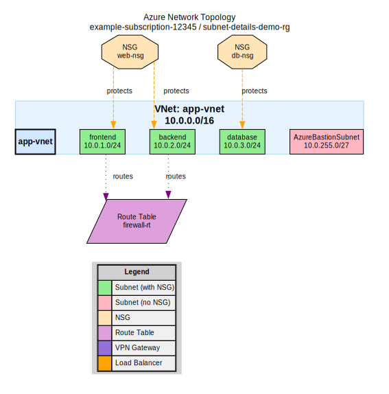
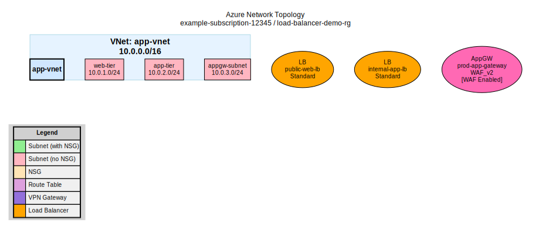
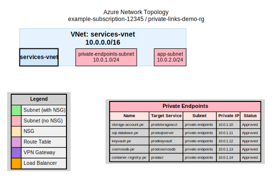
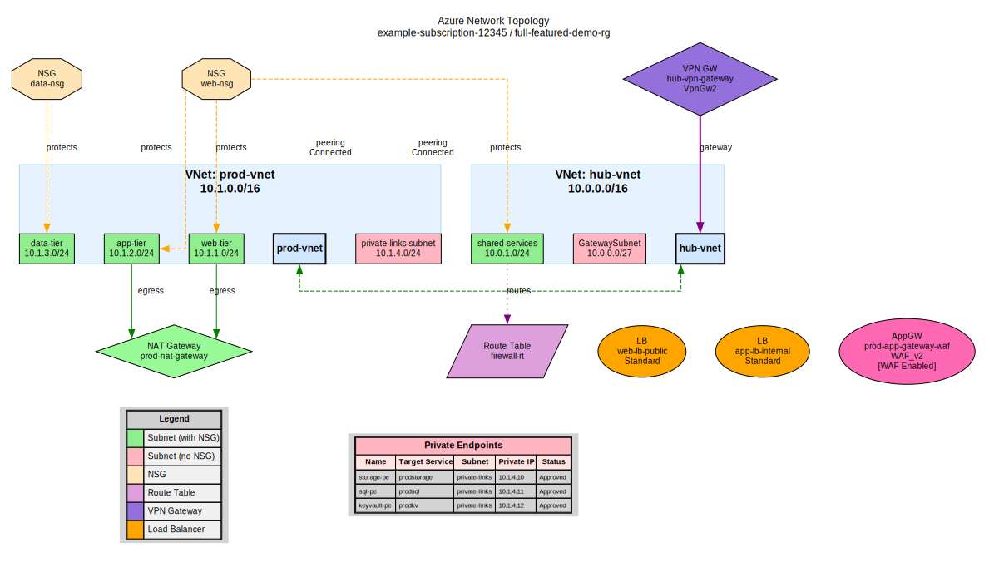

# Azure Network Topology Analyzer

A comprehensive CLI tool for analyzing Azure network infrastructure, identifying security risks, and generating detailed topology reports with visualizations.

## Features

- **Network Discovery** - Automatically discover and catalog all network resources
  - Virtual Networks, Subnets, and Peerings
  - Network Security Groups and Rules
  - Route Tables and Routes
  - NAT Gateways
  - Private Endpoints and Private DNS Zones
  - VPN Gateways and ExpressRoute Circuits
  - Load Balancers and Application Gateways

- **Security Analysis** - Identify potential security risks
  - Exposed sensitive ports (SSH, RDP, databases)
  - Overly permissive NSG rules
  - Subnets without NSG protection
  - Missing WAF on Application Gateways
  - Orphaned/unused resources

- **Multi-Format Reporting**
  - JSON - Complete data for automation
  - Markdown - Documentation-friendly format
  - HTML - Rich formatted reports with styling

- **Network Visualization**
  - Graphviz DOT format
  - SVG vector diagrams
  - PNG raster images
  - Color-coded topology maps

## Visualization Examples

The Azure Network Topology Analyzer generates comprehensive, professional network topology visualizations with detailed information about your Azure network infrastructure. All examples use realistic Azure network configurations to demonstrate the tool's capabilities.

### Simple Hub-Spoke Topology

*A basic hub-and-spoke architecture with central hub VNet and multiple spoke VNets connected via VNet peering. Includes VPN gateway for hybrid connectivity.*

### NAT Gateway Sharing

*Multiple subnets sharing a single NAT gateway - demonstrates smart deduplication where the NAT gateway appears once with connections from multiple subnets.*

### Subnet-Level Details

*Detailed view showing subnets with Network Security Groups (NSGs) and Route Tables, clearly displaying their associations and relationships.*

### Load Balancer Integration

*Network topology featuring Azure Load Balancers (public and internal) and Application Gateway with Web Application Firewall (WAF).*

### Private Links Table

*Example showing private endpoints displayed in a clean, organized table format below the topology - includes Storage, SQL, KeyVault, CosmosDB, and Container Registry private links.*

### Full-Featured Topology

*Comprehensive example showcasing all supported Azure networking resources: VNets, peerings, VPN gateway, load balancers, WAF, NAT gateways, NSGs, route tables, and private endpoints.*

### Key Features Demonstrated

✨ **Automatic Discovery** - All network resources discovered and visualized automatically
🔗 **VNet Peering** - Peering relationships clearly shown with bidirectional arrows
⚖️ **Load Balancers & WAF** - Load balancers and Application Gateways with WAF integration
🌐 **NAT Gateway Intelligence** - Smart deduplication shows shared NAT gateways correctly
🔐 **Private Links** - Clean tabular display of private endpoint connections
🛡️ **Security Groups** - NSG and route table associations clearly visualized
🎨 **Professional Layout** - Optimized layout with integrated legend and color-coding

[See more visualization options](#visualization-options)

## Quick Start

### Prerequisites

- Go 1.23 or later
- Azure CLI (for authentication)
- Azure subscription with at least Reader access
- Graphviz (optional, for PNG rendering)

### Installation

**From Source:**
```bash
git clone https://github.com/your-org/azure-network-analyzer.git
cd azure-network-analyzer
go build -o az-network-analyzer
```

**Using Go Install:**
```bash
go install github.com/your-org/azure-network-analyzer@latest
```

**Docker:**
```bash
docker pull ghcr.io/YOUR_USERNAME/azure-network-analyzer:latest
docker run -v ~/.azure:/root/.azure ghcr.io/YOUR_USERNAME/azure-network-analyzer:latest analyze \
  --subscription YOUR_SUB_ID --resource-group YOUR_RG
```

### Authentication

The tool uses Azure DefaultAzureCredential, which supports:

1. **Azure CLI** (recommended for local development)
   ```bash
   az login
   ```

2. **Environment Variables**
   ```bash
   export AZURE_CLIENT_ID=your-client-id
   export AZURE_CLIENT_SECRET=your-client-secret
   export AZURE_TENANT_ID=your-tenant-id
   ```

3. **Managed Identity** (for Azure VMs/containers)

4. **Visual Studio Code** credentials

## Usage

### Basic Analysis

```bash
# Analyze a resource group
./az-network-analyzer analyze \
  --subscription "your-subscription-id" \
  --resource-group "your-resource-group"
```

### Output Formats

```bash
# Generate Markdown report (default)
./az-network-analyzer analyze -s SUB_ID -g RG_NAME

# Generate JSON report
./az-network-analyzer analyze -s SUB_ID -g RG_NAME --output-format json

# Generate HTML report
./az-network-analyzer analyze -s SUB_ID -g RG_NAME --output-format html

# Specify output file
./az-network-analyzer analyze -s SUB_ID -g RG_NAME -f my-report.md
```

### Visualization Options

```bash
# Generate SVG diagram (default)
./az-network-analyzer analyze -s SUB_ID -g RG_NAME --viz-format svg

# Generate PNG diagram
./az-network-analyzer analyze -s SUB_ID -g RG_NAME --viz-format png

# Generate DOT file only
./az-network-analyzer analyze -s SUB_ID -g RG_NAME --viz-format dot

# Disable visualization
./az-network-analyzer analyze -s SUB_ID -g RG_NAME --visualize=false
```

### Dry Run Mode

Test the tool without connecting to Azure:

```bash
./az-network-analyzer analyze --dry-run -s test-sub -g test-rg
```

### All Options

```bash
./az-network-analyzer analyze --help

Flags:
  -s, --subscription string    Azure subscription ID (required)
  -g, --resource-group string  Resource group name (required)
  -o, --output-format string   Output format: json|markdown|html (default "markdown")
  -f, --output string          Output file path (auto-generated if not specified)
      --visualize              Generate network topology diagram (default true)
      --viz-format string      Visualization format: svg|png|dot (default "svg")
      --dry-run                Use mock data instead of Azure (for testing)
  -h, --help                   Help for analyze
```

## Output Examples

### Security Findings

The analyzer identifies security risks with severity levels:

- **Critical** - Immediate action required (e.g., SSH exposed to internet)
- **High** - Urgent remediation needed (e.g., subnet without NSG)
- **Medium** - Should be addressed (e.g., wide port ranges)
- **Low** - Best practice recommendations (e.g., missing descriptions)

### Topology Diagram

The generated diagram uses color coding:
- 🟢 **Green** - Subnet with NSG protection
- 🔴 **Pink** - Subnet without NSG (security risk)
- 🟡 **Yellow** - Network Security Group
- 🟣 **Purple** - Route Table / VPN Gateway
- 🟠 **Orange** - Load Balancer

## Project Structure

```
.
├── cmd/                        # CLI commands
│   ├── root.go                 # Root command with global flags
│   └── analyze.go              # Main analyze command
├── pkg/
│   ├── models/                 # Data structures
│   │   └── topology.go         # All Azure resource models
│   ├── azure/                  # Azure SDK integration
│   │   ├── client.go           # Core client and helpers
│   │   ├── vnets.go            # Virtual Network operations
│   │   ├── nsgs.go             # NSG operations
│   │   ├── privatelink.go      # Private Endpoint operations
│   │   ├── routing.go          # Route Table/NAT operations
│   │   ├── gateways.go         # VPN/ExpressRoute operations
│   │   ├── loadbalancers.go    # Load Balancer operations
│   │   ├── networkwatcher.go   # Network Watcher operations
│   │   └── mock_client.go      # Mock data for testing
│   ├── analyzer/               # Analysis logic
│   │   ├── models.go           # Analysis report models
│   │   ├── analyzer.go         # Main analysis engine
│   │   └── security.go         # Security risk detection
│   ├── reporter/               # Report generation
│   │   ├── json.go             # JSON reporter
│   │   ├── markdown.go         # Markdown reporter
│   │   └── html.go             # HTML reporter
│   └── visualization/          # Diagram generation
│       ├── graphviz.go         # DOT file generation
│       └── renderer.go         # SVG/PNG rendering
├── main.go                     # Entry point
├── go.mod                      # Go module definition
├── Dockerfile                  # Container build
└── .github/workflows/          # CI/CD pipelines
```

## Development

### Building

```bash
# Build for current platform
go build -o az-network-analyzer

# Build for specific platform
GOOS=linux GOARCH=amd64 go build -o az-network-analyzer-linux
GOOS=windows GOARCH=amd64 go build -o az-network-analyzer.exe
GOOS=darwin GOARCH=arm64 go build -o az-network-analyzer-darwin
```

### Testing

```bash
# Run all tests
go test ./...

# Run with verbose output
go test ./... -v

# Run with coverage
go test ./... -cover

# Run specific package tests
go test ./pkg/analyzer/...
```

### Code Quality

```bash
# Format code
go fmt ./...

# Lint (requires golangci-lint)
golangci-lint run

# Vet
go vet ./...
```

## Docker

### Build Image

```bash
docker build -t azure-network-analyzer:latest .
```

### Run Container

```bash
# Using Azure CLI credentials
docker run -v ~/.azure:/root/.azure \
  ghcr.io/YOUR_USERNAME/azure-network-analyzer:latest analyze \
  --subscription YOUR_SUB_ID \
  --resource-group YOUR_RG

# Using service principal
docker run \
  -e AZURE_CLIENT_ID=xxx \
  -e AZURE_CLIENT_SECRET=xxx \
  -e AZURE_TENANT_ID=xxx \
  ghcr.io/YOUR_USERNAME/azure-network-analyzer:latest analyze \
  --subscription YOUR_SUB_ID \
  --resource-group YOUR_RG
```

## CI/CD

This project includes GitHub Actions workflows for:

- **Build & Test** - Runs on every push/PR
  - Multi-platform builds (Linux, Windows, macOS)
  - Unit tests with mock data
  - Code coverage reporting

- **Release** - Creates releases with binaries
  - Automated semantic versioning
  - Pre-built binaries for all platforms
  - Docker image publishing

## Contributing

1. Fork the repository
2. Create your feature branch (`git checkout -b feature/amazing-feature`)
3. Commit your changes (`git commit -m 'Add amazing feature'`)
4. Push to the branch (`git push origin feature/amazing-feature`)
5. Open a Pull Request

### Guidelines

- Follow Go best practices and idioms
- Add tests for new functionality
- Update documentation for user-facing changes
- Use conventional commit messages

## Security

- Never commit Azure credentials
- Use least-privilege access (Reader role is sufficient)
- Review security findings promptly
- The tool only reads data; it makes no modifications

## License

MIT License - see LICENSE file for details.

## Acknowledgments

- Azure SDK for Go
- Cobra CLI framework
- go-graphviz for visualization
- All contributors

---

*Built with Go and powered by Azure SDK*
